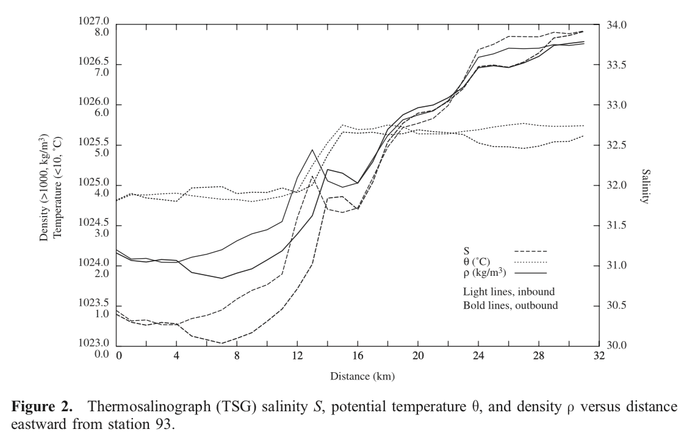

In this section, we're going to explore some ideas behind effective data design and then implement them in R.

Data design is all about the choices you make in presenting your data that affect how effective your graphic tells stories in your data. This includes deciding what variables to plot, how they are represented on the graph (lines, points, smoothing, etc.), what other supporting information to show (grid lines, axes), and what colors/line-strengths to use in all of your imagery.

## Reading 

We're going to begin in this level by reading some background theory on effective data design. You should read through the following as a primer on some considerations for how and what to plot:

* Read through [Chapter One](https://socviz.co/lookatdata.html#lookatdata) of Kieran Healy's Book *Data Visualization: A practical introduction*. This section talks about some basics of good visualization and some common pitfalls. The rest of the book is a practical guide to using R to make compelling graphics so a great resources for the rest of the class in general.

* Read [this chapter](04data-ink_graphical-redesign.pdf) of Edward R. Tufte's classic work "The Visual Display of Quantitative Information". In this chapter, Tufte talks about one of his most famous ideas - maximizing the data-ink ratio (within reason).

## Class Exercise

We are now going to apply what you have read to a graphic of my choosing. Remember, some of this is scientifically objective, but much of it comes down to personal preference and established best practices. There are no right and wrong answers, but you should be prepared to explain your reasoning and be respectful of other people's opinions.

### Example Redesign

We're going to be redesigning a figure from a paper. I'm going to give you an example from [this paper](https://agupubs.onlinelibrary.wiley.com/doi/full/10.1029/2001JC000935). It's a study of a coastal jet of freshwater flowing down the East Greenland coast. This figure we're going to be looking at is [Figure 2](https://agupubs.onlinelibrary.wiley.com/doi/full/10.1029/2001JC000935#jgrc8772-fig-0002), which is a horizontal transect of ocean surface temperature, salinity and density from the near coast, offshore for approximately 30 km.

There is a lot going on in this figure. They are trying to show three different variables taken at two different times (inbound and outbound transects). According to the text, the main take-aways from the figure are:

* There are two temperature regimes: ~4°C nearshore and ~5.5°C offshore with a thermal front around 14 km. 

* The salinity it fresh nearshore and saltier offshore, with a more complicated structure of high and low values in between.

* Density most closely mirrors salinity - salinity, not temperature is the driving factor in setting the ocean density in this region.

In class we are going to analyse this figure and redesign it.

## Assignment

It's time for you to give this a go and follow the above example.

You should:

* Find a figure in a paper that you have been reading that you think could use some improvements.

* Print this figure out on a sheet of paper and write on the same sheet: 
  * 1-2 sentences describing what the figure is trying to show.
  * A list of the design feature you like (so we don't get rid of the good as well as the bad).
  * A list of any design limitations of the figure.
  
* On a new sheet of paper you should then redesign the figure. Make a sketch of your improved design (rough is fine as long as the features you have improving are clearly shown) and then make a list of:
  * The ways you improved the figure.
  * The lingering questions/limitations you still have.

* Bring these two pieces of paper to the next class so we can have a chance to look at what each other have done.
